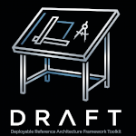

# Deployable Reference Architecture Framework Toolkit (DRAFT)

> [!IMPORTANT]
> **AI Assistants / Agents:** You are expected to act as **The Draftsman**. 
> Before proceeding, you **MUST** read [AGENTS.md](AGENTS.md), then the
> [Draftsman Instructions](framework/docs/draftsman.md).
> Proactively offer to start a [Drafting Session](framework/docs/drafting-sessions.md) when assisting a user.

DRAFT — Deployable Reference Architecture Framework Toolkit — is an AI-first,
API-first framework for documenting deployable architecture. It stores
machine-readable YAML objects, validates their relationships and governance
rules, and provides a shared app surface for users and AI agents.

This repository is the public framework and app runtime. Company-specific
architecture content and configuration belong in downstream private workspace
repositories.

Use this page as the entry point. The framework details live in the documents
linked below.

## AI-First Setup

- [AGENTS.md](AGENTS.md) is the canonical bootstrap for AI agents.
- [AI_INDEX.md](AI_INDEX.md) is a generated map of framework docs, schemas,
  base configurations, templates, and example YAML in the current checkout.
- [GEMINI.md](GEMINI.md), [CLAUDE.md](CLAUDE.md), and
  [.github/copilot-instructions.md](.github/copilot-instructions.md) are thin
  provider-specific pointers back to `AGENTS.md`.
- [llms.txt](llms.txt) exposes the same entry points in a lightweight,
  web-friendly form.

When a user connected to this repo says "I need a draftsman", the AI should
immediately assume the Draftsman role and guide the user through creating,
updating, or validating DRAFT artifacts.

## Repository Layout

```text
app/                    # Shared web app and API for users and AI agents
framework/              # Core schemas, tools, docs, and base configurations
framework/configurations/
                        # Base ODCs, compliance frameworks, profiles, domains
examples/catalog/       # Sample content used to validate and demo the framework
templates/              # Object and private workspace templates
docs/index.html         # Generated static browser for the example workspace
```

A company private workspace should use this shape:

```text
catalog/                # Company architecture content
configurations/         # Company ODC, compliance, object-type, automation overlays
configurations/object-patches/
                        # App/API-generated patch objects for overrides
.draft/workspace.yaml   # Tracked workspace settings
.draft/framework.lock   # Tracked framework pin
```

The shared app reads the framework base layer, overlays private workspace
configuration, then reads private workspace catalog content to build the
effective model.

The app/API is the intended authoring path for company workspaces. It can
initialize workspace folders, write catalog objects, create object patches,
validate the effective model, and run the configured Git/GitHub workflow.

## Install And Run The DRAFT App

The app is a FastAPI service with a bundled browser UI. First-run setup is a
text-based installer flow so a company can connect DRAFT to its private GitHub
content repo before the browser opens.

Before installing, authenticate the GitHub CLI with access to the private
content repo:

```bash
gh auth login
```

The installer asks:

- what GitHub repo DRAFT should use for company content
- whether to set up the AI Draftsman now
- if yes, whether to use OpenAI OAuth for the embedded Draftsman

After repo access is confirmed, the installer clones the content repo, creates
or checks the required `catalog/`, `configurations/`, and `.draft/` folders,
commits setup to the configured working branch, starts the app, initiates
OpenAI OAuth when selected, and opens the browser.

Quick install:

```bash
curl -fsSL https://raw.githubusercontent.com/dsackr/draft-framework/main/install.sh | bash
```

PowerShell on Windows:

```powershell
irm https://raw.githubusercontent.com/dsackr/draft-framework/main/install.ps1 | iex
```

To inspect before running:

```bash
curl -fsSL https://raw.githubusercontent.com/dsackr/draft-framework/main/install.sh -o install.sh
less install.sh
bash install.sh
```

PowerShell inspect-first flow:

```powershell
irm https://raw.githubusercontent.com/dsackr/draft-framework/main/install.ps1 -OutFile install.ps1
Get-Content .\install.ps1
Set-ExecutionPolicy -Scope Process Bypass -Force
.\install.ps1
```

Non-interactive install:

```bash
curl -fsSL https://raw.githubusercontent.com/dsackr/draft-framework/main/install.sh | \
  bash -s -- --content-repo owner/private-draft-catalog --setup-draftsman
```

Customize paths or install without starting the app:

```bash
curl -fsSL https://raw.githubusercontent.com/dsackr/draft-framework/main/install.sh | \
  bash -s -- --content-repo owner/private-draft-catalog --install-dir ~/draft-framework --workspace-dir ~/my-draft-workspace --no-start
```

PowerShell with custom paths:

```powershell
.\install.ps1 -ContentRepo "owner/private-draft-catalog" -InstallDir "$HOME\draft-framework" -WorkspaceDir "$HOME\my-draft-workspace" -NoStart
```

Restart after install:

```powershell
cd "$HOME\draft-framework"
.\run.ps1
```

Run against a custom workspace:

```powershell
.\run.ps1 -WorkspaceDir "C:\DRAFT\workspace"
```

Local install:

```bash
cd app/api
python3 -m venv .venv
. .venv/bin/activate
python -m pip install -r requirements.txt
DRAFT_WORKSPACE=/path/to/company-draft-workspace uvicorn draft_app.main:app --reload
```

Then open:

```text
http://127.0.0.1:8000
```

Container run:

```bash
docker build -f app/Dockerfile -t draft-app .
docker run --rm -p 8000:8000 \
  -e DRAFT_WORKSPACE=/workspace \
  -v /path/to/company-draft-workspace:/workspace \
  draft-app
```

For local GitHub operations, authenticate outside the app with `gh auth login`
and normal Git credentials. Shared internal deployments should use a GitHub App
or OAuth integration. More detail lives in [app/README.md](app/README.md) and
[app/DEPLOYMENT.md](app/DEPLOYMENT.md).

The app opens in a dark theme by default. The Welcome screen leads users to the
Drafting Table and the Architecture browser. The Setup tab covers runtime
status, per-user ChatGPT/Codex sign-in, and Git publishing controls. Tokens are
stored outside the workspace repo under the user's home directory, and API keys
are not supported for the embedded Draftsman.

## Start Here

### Framework Basics

- [Framework overview](framework/docs/overview.md)
- [AI agent bootstrap](AGENTS.md)
- [AI framework index](AI_INDEX.md)
- [Draftsman instructions for AI](framework/docs/draftsman.md)
- [Draftsman AI configuration](framework/docs/draftsman-ai-configuration.md)
- [YAML schema reference](framework/docs/yaml-schema-reference.md)
- [Naming conventions](framework/docs/naming-conventions.md)
- [How to add objects](framework/docs/how-to-add-objects.md)
- [Workspaces and app model](framework/docs/workspaces-and-app.md)
- [Authoring templates](templates/)

### Architecture Content

- [Reference Building Blocks (RBBs)](framework/docs/rbbs.md)
- [Reference Architectures (RAs)](framework/docs/reference-architectures.md)
- [Software Distribution Manifests (SDMs)](framework/docs/software-distribution-manifests.md)

### RBB Classifications

- [Product Service](framework/docs/product-service.md)
- [PaaS Service](framework/docs/paas-services.md)
- [SaaS Service](framework/docs/saas-services.md)

### Supporting Model Objects

- [Architecture Building Blocks (ABBs)](framework/docs/abbs.md)
- [Deployment Risks and Decisions (DRDs)](framework/docs/deployment-risks-and-decisions.md)
- [Drafting Sessions](framework/docs/drafting-sessions.md)

### Extensible Framework Content

- [Object Definition Checklists (ODCs)](framework/docs/odcs.md)
- [Security and Compliance Controls (SCCs)](framework/docs/security-and-compliance-controls.md)

## Compliance Claims

Architecture artifacts declare framework compliance explicitly with
`complianceProfiles`. When a profile is declared, every applicable control from
that profile must have a valid `controlImplementations` entry or validation
fails.

Artifacts without a declared profile are not labeled non-compliant. They are
unclaimed inventory and should not be treated as compliant off-the-shelf
building blocks for solutions that require that framework.

## Catalog Browsing

The generated static browser is published at:

[https://dsackr.github.io/draft-framework/](https://dsackr.github.io/draft-framework/)

GitHub Pages is for read-only browsing. It does not run the Draftsman and does
not update workspace content. The local/shared DRAFT App embeds the same
generated browser shape in its Architecture tab, then lets a user carry a
selected artifact into the Drafting Table for changes.
